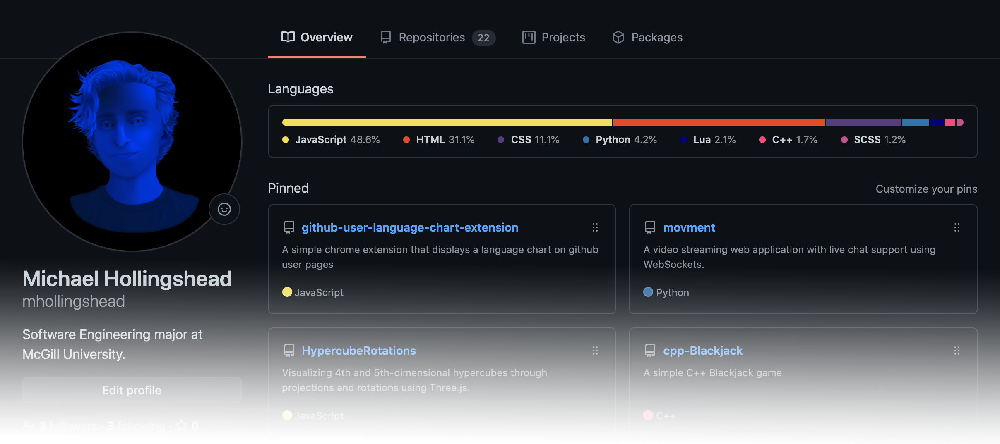

<div align="center">
    <h1>GitHub User Linguist Chart</h1>
</div>
<div align="center">
    
    <p></p>
</div>
<p align="center">
    <i>Chart the languages used throughout all repositories belonging to any GitHub user.</i><br/><br/>
</p>

* **[The extension](https://github.com/mhollingshead/github-user-linguist-chart#chrome-extension)** automatically injects the chart as a profile section when browsing GitHub.

* **[The API](https://github.com/mhollingshead/github-user-linguist-chart#api)** generates an SVG that can be used in a profile README.md or anywhere on the web.


<div align="center"><br/></div>

## Chrome Extension

Use the Chrome extension to visualize the spread of repo languages for any user. If installed and turned on, it will automatically inject the chart into any user page visited on GitHub as a profile section.


### Installation Instructions

1. Download the repo as a **[ZIP file from GitHub](https://github.com/mhollingshead/github-user-language-chart-extension/archive/refs/heads/main.zip)**.
2. Unzip the file and you should have a folder named `github-user-language-chart-extension-main`.
3. In Chrome, go to the extensions page (`chrome://extensions/`).
4. Enable **Developer Mode**.
5. Drag the folder (`github-user-language-chart-extension-main`) anywhere on the page to import it.


### Demo

View the **[interactive demo](https://mhollingshead.github.io/github-user-linguist-chart/)** for examples of any GitHub user's chart, and what their page would look like with the extension enabled.


### Example

<div align="center">
    
    
    <p></p>
</div>

<div align="center"><br/></div>

## API

*The extension charts are visible to you only. If you want **everyone** to see your chart, consider using the API.* 

The API allows you to make a request to a given GitHub username's endpoint and sends back an SVG version of their chart that can be used in your GitHub README.md or anywhere on the web.

A simple implementation would look something like this:
<div align="center"><p></p></div>

**HTML**
```html

```

**Markdown**
```md

```


### Request URLs

Request URLs should be structured as follows:
```
https://github-user-linguist-chart.herokuapp.com/<YOUR USERNAME>?<OPTION 1>&<OPTION 2>&<...>
```


### Options

There are several options you can provide to customize the componet style:

| Option | Values | Default | Description |
|---|---|---|---|
| `width` | `number` (min `400`, max `2000`) | `904` | The width of the SVG image in `px`. |
| `theme` | `default_light` \| `default_dark` \| `dark_dimmed` \| `dark_high_contrast` \| `universal` | `default_light` | The theme of the component. All GitHub themes are accepted. Additionally, `universal` uses mid-range colors that work on both dark and light backgrounds. |
| `background` | `true` \| `false` | `true` | If `false`, the background, border, and component padding will be removed. |
| `border` | `true` \| `false` | `true` | This option only applies when `background` is `true`. If `false`, the outer border will be removed. | 
| `title` | `true` \| `false` | `true` | If `false`, the title will be ommitted. |
| `title_text` | `String` (URI encoded) | `Languages` | The text contents of the component title. Be cautious of the length of your title as word-wrap currently isn't supported. |


### Examples

Below are some examples of various options. To use the code snippets, replace `<USERNAME>` with your username and `<OPTS>` with any additional options.

#### Width

`width=600`:

<div align="center"><p></p></div>

```html
?width=600" />
```

```md

```


#### Background

`background=false`:

<div align="center"><p></p></div>

```html
?<OPTS>&background=false" />
```

```md

```


#### Theme

`theme=default_dark`:

<div align="center"><p></p></div>

```html
?<OPTS>&theme=default_dark" />
```

```md

```


  
`theme=dark_dimmed`:

<div align="center"><p></p></div>

```html
?<OPTS>&theme=dark_dimmed" />
```

```md

```

`theme=dark_high_contrast`:

<div align="center"><p></p></div>

```html
?<OPTS>&theme=dark_high_contrast" />
```
  
```md

```

`theme=universal`:

<div align="center"><p></p></div>

```html
?<OPTS>&theme=universal" />
```

```md

```

#### Border

`border=false`:

<div align="center"><p></p></div>

```html
?<OPTS>&border=false" />
```

```md

```


#### Title

`title=false`:

<div align="center"><p></p></div>

```html
?<OPTS>&title=false" />
```

```md

```


#### Title Text

`title_text=My%20Repo%20Languages`:

<div align="center"><p></p></div>

```html
?<OPTS>&title_text=My%20Repo%20Languages" />
```

```md

```

<div align="center"><br/></div>

## Limits & Data

### Extension
* The extension uses the GitHub API to get user data. Each new user page visited requires 1 request for their repo list and `<number of repos>` requests for the languages used in each repo– making a total of `<number of repos> + 1` API requests. 
* Because of the API's rate limit, accessing many profiles *(especially profiles with large amounts of repositories)* in a short amount of time could result in reaching the rate limit. If a request results in a non-ok response, no chart will be injected until requests can be made again.
* Cookies are used to save user data that has already been received within the last hour in order to reduce API requests.

### API
* The API uses the GitHub API server-side. Each user image requested requires the same `<number of repos> + 1` amount of API requests.
* To reduce the number of API requests made by the server, images are cached for 2 hours after rendering.