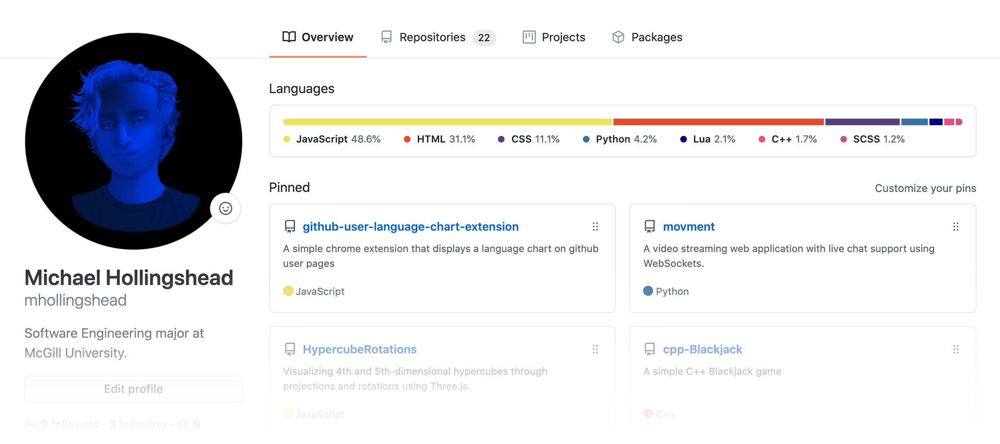

# GitHub User Linguist Chart

*A simple Chrome extension that charts the languages used throughout users' repos and displays them as a profile section.*

### Installation Instructions

1. Download the repo as a [ZIP file from GitHub](https://github.com/mhollingshead/github-user-language-chart-extension/archive/refs/heads/main.zip).
2. Unzip the file and you should have a folder named `github-user-language-chart-extension-main`.
3. In Chrome, go to the extensions page (`chrome://extensions/`).
4. Enable **Developer Mode**.
5. Drag the `extension` folder (`github-user-language-chart-extension-main/extension`) anywhere on the page to import it.

### Demo

View the [interactive demo](https://mhollingshead.github.io/github-user-language-chart-extension/) for examples of any GitHub user's chart, and what their page would look like with the extension enabled.

### Example

##### Notes
* This extension uses the GitHub API to get user data. Each new user page visited requires 1 request for their repo list and `<number of repos>` requests for the languages used in each repo– making a total of `<number of repos> + 1` API requests. 
* Because of the API's rate limit, accessing many profiles *(especially profiles with large amounts of repositories)* in a short amount of time could result in reaching the rate limit. If a request results in a non-ok response, no chart will be injected until requests can be made again.
* Cookies are used to save user data that has already been received within the last hour in order to reduce API requests.